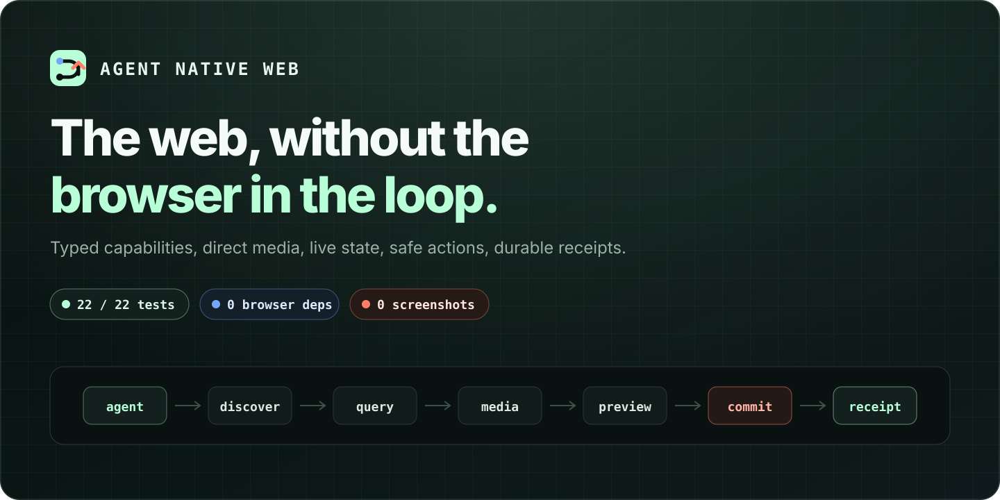
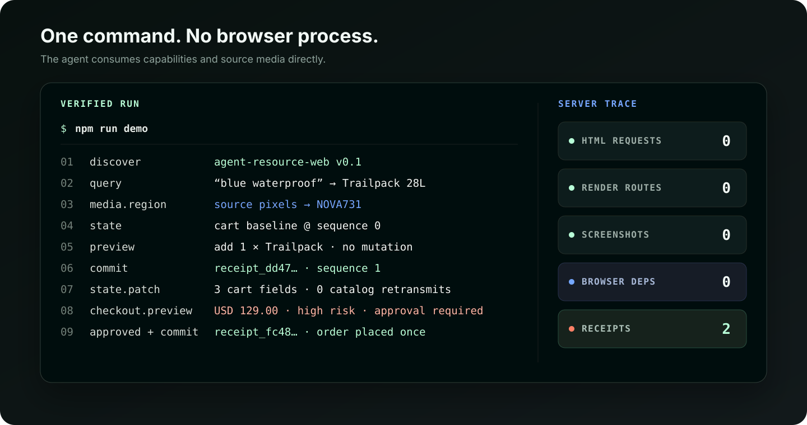
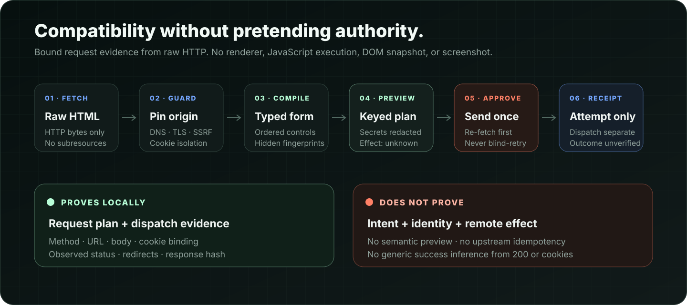
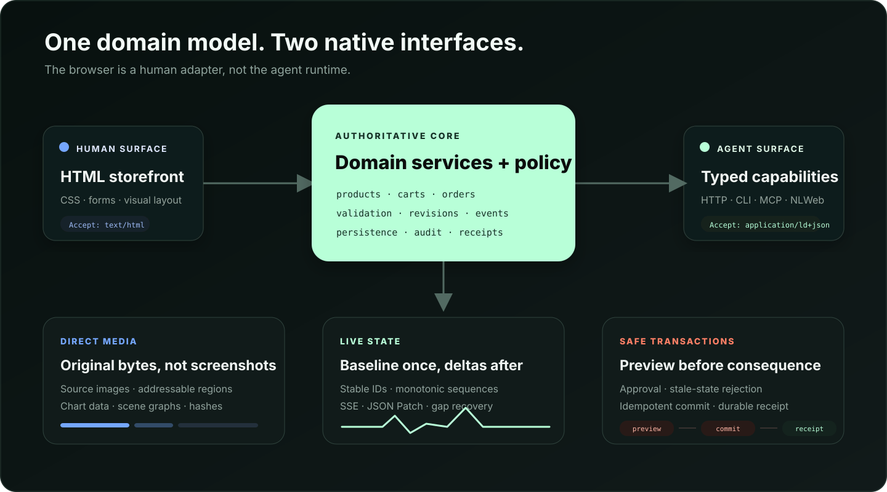

<h1 align="center">Agent Native Web</h1>

<p align="center">
  <strong>Automate the contract, not the screen.</strong><br>
  Native typed capabilities for cooperating sites, plus a conservative HTTP bridge for standard forms on legacy sites.
</p>

<p align="center">
  
</p>

<p align="center">
  <a href="https://github.com/avasis-ai/agent-native-web/actions/workflows/ci.yml"></a>
  
  
  
  <a href="./LICENSE"></a>
</p>

Cooperating sites expose a manifest, stable domain IDs, direct media, sequenced state, and typed actions. The included storefront completes an authenticated purchase without loading its human page, starting a browser, reading a DOM, or taking a screenshot. A separate compatibility bridge can infer deterministic application-request plans from inert standard HTML.

> [!IMPORTANT]
> Native contracts and inferred HTML are different trust rails. `AgentWebClient` still rejects HTML-only sites with `UNSUPPORTED_AGENT_SITE`; it never silently sends the native bearer token to a fallback. `HttpBridgeClient` must be selected explicitly, never executes JavaScript, and reports remote outcomes as unverified unless a reviewed adapter supplies stronger evidence.

## Run the proof

You need Node.js 22.19 or newer.

```bash
npm ci
npm run verify
npm run demo
```

The demo discovers the site, queries products, reads a bounded source-image region, previews and commits a cart update, consumes its state patch, requests checkout approval, and returns two receipts.

<p align="center">
  
</p>

The following is a compact composite of values emitted by `npm run demo` and the separate no-browser scanner inside `npm run verify`; it is not a literal single-command response envelope:

```json
{
  "inspection_mark": "NOVA731",
  "receipts": 2,
  "human_html_requests": 0,
  "render_requests": 0,
  "screenshot_requests": 0,
  "production_browser_dependencies": 0
}
```

## Compatibility without a browser

For a legacy site, the bridge fetches raw HTTP, parses HTML with an inert WHATWG-oriented parser, preserves real form semantics such as duplicate names and submitter overrides, and emits a redacted `request_preview`.

```bash
node src/cli.mjs bridge inspect https://example.com/login

# Keep reusable cookies separate from one-shot dispatch authority.
mkdir -m 700 .agentweb-private

printf 'Form JSON (input is hidden): ' >&2
IFS= read -r -s form_input
printf '\n' >&2

printf '%s' "$form_input" |
  node src/cli.mjs bridge prepare https://example.com/login \
    --action action_id --input - \
    --session-file .agentweb-private/session.json \
    --approval-file .agentweb-private/approval.json

# Review preview.approval_binding_digest, then submit the same input:
printf '%s' "$form_input" |
  node src/cli.mjs bridge submit https://example.com/login \
    --action action_id --input - \
    --session-file .agentweb-private/session.json \
    --approval-file .agentweb-private/approval.json \
    --approval-binding-digest 'hmac-sha256:from-prepare' \
    --allow-unverified-write

# The approval file is gone; response cookies remain for the next safe read.
node src/cli.mjs bridge inspect https://example.com/account \
  --session-file .agentweb-private/session.json

unset form_input
```

Before any submission it re-fetches the form and checks its structure, full normalized semantic text, accessible-name sources, action, submitter, validation mode, hidden values, newly detected auth interactions, and the exact Cookie header selected for the target origin, path, and SameSite context. Public review text stays bounded, while the private freshness digest covers the full relevant text. Every editable control needs an explicit value: empty string, `false`, `[]`, or `null` must be chosen deliberately instead of inheriting an invisible HTML default. Every inferred request needs approval of its bound application-request plan plus an `--allow-unverified-write` acknowledgement. Secret-bearing fingerprints and every untrusted public URL path segment use a private keyed HMAC, not an offline-guessable hash. The result is an `attempt_receipt` with separate dispatch and outcome states; HTTP 200, a redirect, or a new cookie is not mislabeled as business success.

The current bridge handles static UTF-8 GET forms and URL-encoded POST forms, including ordinary username/password and user-supplied OTP fields with an exact-origin cookie jar. It refuses cross-origin navigation/actions, file/image submitters, multipart, temporal controls not yet represented faithfully, and script-only workflows. Directly detected known CAPTCHA markup and passkey-only or OAuth authorization forms produce typed handoffs; heuristic auth text never blocks, and a password fallback remains preparable. OAuth metadata validation checks only the conservative syntax of caller-supplied data—it does not establish issuer trust or run a token flow. The bridge also honors relevant CSP form restrictions and browser validation bypasses. JavaScript-bearing pages are marked lower-assurance even when their static form remains preparable.

<p align="center">
  
</p>

The bridge does not load CSS, images, or other subresources, so it cannot establish visual visibility or relevance and does not read arbitrary page images. Direct source-media access belongs to a native contract or reviewed adapter; screenshots remain necessary when rendered pixels are the evidence.

On the local Apple Silicon acceptance run, 100 inert parse/compile samples measured 0.509 ms p50 and 100 complete local HTTP inspections measured 0.942 ms p50. These are bridge-overhead measurements, not a controlled Playwright comparison. Run `npm run benchmark:bridge -- 100` on your machine.

See [HTTP Form Bridge 0.1 draft](./docs/http-bridge.md) for the assurance model, auth matrix, threat boundary, CLI flow, and use-case analysis. The [landscape review](./docs/landscape.md) compares CloakBrowser, OpenCLI, AutomatiQ, WebMCP, and the main browser-agent stacks without claiming that adjacent work does not exist.

## Contract-native automation

| Concern | UI-driving automation | Agent Native Web |
|---|---|---|
| Runtime target | Rendered page in a browser engine | Typed site contract |
| Identity | Selectors, text matches, coordinates | Stable domain IDs |
| Reads | DOM, accessibility tree, screenshots | Scoped state and RFC 6902 patches |
| Images | Rendered pixels or OCR | Original bytes and bounded source regions |
| Charts and maps | Recover data from presentation | Data/specification or scene graph |
| Writes | Click, type, wait | Preview, confirm, idempotent commit |
| Evidence | Logs, recordings, screenshots | Receipt and sequenced state event |
| Coverage | Browser-accessible interfaces | Sites that expose the contract |
| Unsupported work | Tool-specific fallback | Typed refusal without a render fallback |

The HTTP bridge now removes the browser for a conservative standard-form subset of unmodified sites. Browser automation remains the compatibility path for arbitrary JavaScript and visual interaction. Native contracts remain the only rail here that can provide site-authoritative effect previews, idempotent commits, and durable outcome receipts.

## Architecture

Both surfaces call one authoritative domain core. The CLI and MCP server reuse the HTTP client; they do not contain a second mock store or a second policy implementation.

<p align="center">
  
</p>

The reference implements four connected layers:

- **Resources:** versioned entities, structured queries, negotiated representations, and stable links.
- **Media:** original PNG bytes, named source regions, content hashes, chart data/specification, and a warehouse scene graph.
- **State:** a keyed semantic baseline followed by resumable JSON Patch events over SSE.
- **Actions:** strict schemas, effect previews, approval, stale-state checks, idempotent commits, and persistent receipts.

The compatibility bridge sits outside that authoritative core. It observes legacy HTTP, compiles a lower-assurance request candidate, and never upgrades its local attempt receipt into a site receipt. Keeping those planes separate prevents an inferred form from inheriting native-contract authority.

## Direct media

The blue product descriptor names an `inspection-mark` region without exposing its value. `NOVA731` exists only in the raster pixels. The client requests that 50×50 source region, verifies its hash, and feeds the bytes to the sample decoder.

```bash
node src/cli.mjs media read-mark 'media:trailpack-blue:hero'

node src/cli.mjs media fetch 'media:trailpack-blue:hero' \
  --region inspection-mark \
  --output inspection.png
```

MCP tool `agent.media.read` returns the same original or region bytes as `ImageContent`. A multimodal model can consume those bytes without a page capture. The chart and map endpoints return their source data and scene graph because an agent should not reconstruct known data from pixels.

## Safe writes

Every mutation follows one server-owned path:

```text
strict input → preview → approval when required → idempotent commit → receipt
```

A preview validates arguments, captures relevant revisions, simulates the effect, and expires after five minutes. It creates no durable domain change. Commit authenticates the principal again, checks the captured revisions, requires confirmation for checkout, records one event, and stores a receipt.

Every commit requires `Idempotency-Key`. A retry with the same principal, preview, and key returns the first receipt. Reusing a key for another request returns `IDEMPOTENCY_CONFLICT`. The test suite sends 20 concurrent retries and observes one mutation.

Inferred HTML writes do **not** inherit these guarantees. They use `request_preview → approval → one dispatch → attempt_receipt`; the bridge will not retry an ambiguous POST and will not claim upstream idempotency or success.

## Interfaces

| Interface | Entry point | Purpose |
|---|---|---|
| Discovery | `GET /agent/manifest.json` | Contract, authentication, capabilities, adapters |
| OpenAPI | `GET /openapi.json` | HTTP operation descriptions |
| Negotiation | `GET /products/:id` | HTML, Markdown, JSON-LD, or experimental agent JSON |
| Query | `QUERY /api/agent/v1/entities` | Safe structured product search |
| State | `GET /api/agent/v1/state?scope=cart` | Keyed baseline and sequence |
| Changes | `GET /api/agent/v1/events?since=N` | SSE JSON Patch stream |
| Media | `GET /api/agent/v1/media/:id` | Source metadata, hashes, regions, provenance |
| Preview | `POST /api/agent/v1/actions/:action/preview` | Validate and disclose effects |
| Commit | `POST /api/agent/v1/commits` | Revalidate and mutate once |
| Receipt | `GET /api/agent/v1/receipts/:id` | Persistent local audit record |
| NLWeb | `POST /ask` | NLWeb 0.55 response-structure adapter |
| MCP | `node src/mcp.mjs` | Tools and binary/JSON resources over stdio |

The Agent Resource Web profile and `application/agent+json` media type remain experimental. The implementation uses existing standards where they fit, including HTTP content negotiation, JSON-LD, RFC 6902 JSON Patch, SSE, MCP, Schema.org, and W3C-style fragment selectors.

## CLI

```bash
node src/cli.mjs discover
node src/cli.mjs query --colour blue --in-stock
node src/cli.mjs state --scope cart
node src/cli.mjs actions
node src/cli.mjs preview cart.add \
  --args '{"product_id":"product:trailpack-blue","quantity":1}'
node src/cli.mjs events --since 0
node src/cli.mjs media data 'media:inventory:chart'
```

`agentweb bridge inspect|prepare|submit` is routed before the native client is created, so `AGENT_TOKEN` cannot leak to an inspected HTML origin. Form-field values are accepted only as JSON on stdin; cookies enter only through dedicated session state. Cross-process work uses two owner-only `0600` files: reusable, exact-origin cookie state and a short-lived one-shot approval containing the private HMAC key. Commands are serialized with a per-session lock. Immediately before any approved dispatch, the CLI durably advances the session generation and removes the approval; a copied approval cannot replay against the live session. Response cookies are then atomically persisted for later authenticated forms. These files are sensitive and are not encrypted or rollback-proof. The CLI writes success results as JSON, protocol problems as JSON to stderr, and uses the [documented category exit codes](./docs/http-bridge.md#cli).

## MCP

Start the HTTP service, then point an MCP client at the stdio adapter:

```json
{
  "command": "node",
  "args": ["/absolute/path/to/agent-native-web/src/mcp.mjs"],
  "env": {
    "AGENT_BASE_URL": "http://127.0.0.1:4317",
    "AGENT_TOKEN": "replace-this-token"
  }
}
```

The adapter implements MCP `2025-11-25` initialization, tools, resource listing, and resource reads. Authentication stays in the transport configuration instead of tool arguments.

## Run the service

```bash
AGENT_TOKEN='replace-this-token' npm start
```

The human storefront runs at `http://127.0.0.1:4317/`. Agents start at `/agent/manifest.json` and do not request `/`.

Docker Compose runs the service as an unprivileged user with a read-only root filesystem:

```bash
AGENT_TOKEN='replace-this-token' docker compose up --build
```

The standalone server writes state, events, receipts, and the idempotency ledger to `data/state.json`. Set `AGENT_DATA_FILE=:memory:` for disposable runs.

## Verification

```bash
npm run verify
npm run benchmark -- 100
```

The final local acceptance run passed 94 tests across the native HTTP/CLI/MCP paths and adversarial bridge form, auth, cookie/session binding, CSP, SSRF, redirect, drift, approval, privacy, bounded-execution, and ambiguous-transport cases. The scanner checked 20 production source files and found zero browser packages or runtime hooks across four direct production dependencies.

| Local operation | Samples | p50 | p95 |
|---|---:|---:|---:|
| Typed product query | 100 | 1.737 ms | 3.212 ms |
| Scoped state baseline | 100 | 1.423 ms | 1.825 ms |
| Direct source-image region | 100 | 2.838 ms | 3.334 ms |
| Inert HTML parse + form compile | 100 | 0.265 ms | 1.007 ms |
| Complete local HTTP form inspection | 100 | 0.818 ms | 2.087 ms |

These numbers measure warm local overhead on the development Apple Silicon machine. They exclude model time and do not constitute a controlled comparison with Playwright or CloakBrowser. See [VERIFICATION.md](./VERIFICATION.md) for the evidence record.

## Project status

Tag `v0.1.0` proves the full contract-native path for the included storefront. The default branch adds the experimental HTTP Form Bridge 0.1 draft. It is useful for stable standard forms, but it is not a complete browser replacement and should not be used as an unauthenticated remote fetch service.

Public native-contract deployments still need OAuth 2.0 authorization code with PKCE following RFC 9700, a transactional database and outbox, tenant isolation, encrypted sensitive fields, distributed limits, and signed audit retention. Public bridge deployments additionally need an authenticated local/tenant boundary, egress allowlists, an encrypted credential vault, and reviewed site adapters for consequential operations.

Planned work:

- extract both profile conformance suites from the demo domain;
- add signed, version-pinned adapters and postcondition verifiers for one authenticated SaaS application;
- add authorized artifact handles and bounded multipart support without accepting arbitrary filesystem paths;
- add OAuth protected-resource discovery and external-user-agent handoff without scraping login pages;
- publish controlled browser and contract-native benchmark workloads;
- test interoperable IIIF, C2PA, OAuth, and remote MCP deployments.

## Documentation

- [Protocol profile](./docs/protocol.md)
- [HTTP Form Bridge](./docs/http-bridge.md)
- [Browser automation landscape](./docs/landscape.md)
- [Adoption guide](./docs/adopting.md)
- [Security boundary](./docs/security.md)
- [Verification record](./VERIFICATION.md)
- [Contributing guide](./CONTRIBUTING.md)
- [Changelog](./CHANGELOG.md)

## Contributing

Issues and focused pull requests are welcome. Read [CONTRIBUTING.md](./CONTRIBUTING.md) before proposing a protocol change. Security reports should follow [SECURITY.md](./SECURITY.md).

## License

[MIT](./LICENSE)
